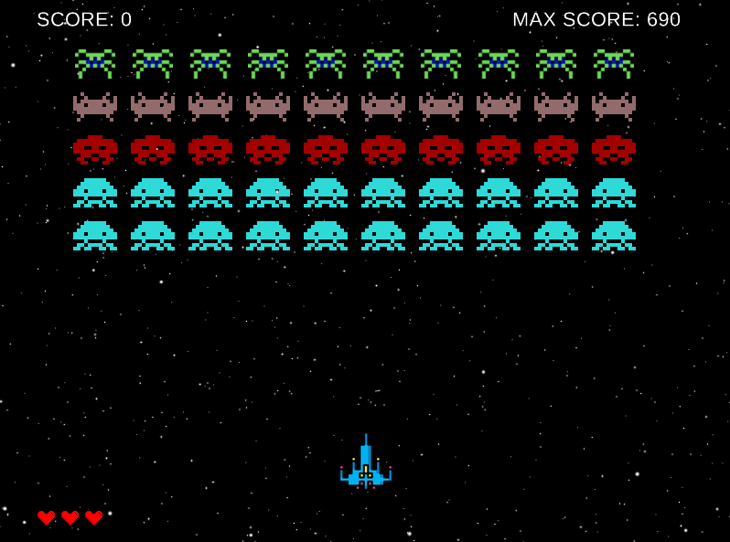

# Classic Space Invaders Game

<p align="center">
  
</p>

## Features

- Player moves ship horizontally by pressing on keyboard :heavy_check_mark:
- Player shoot aliens, which can move horizontally & vertically :heavy_check_mark:
- When bullet reach alien, alien disappear & total score increase :heavy_check_mark:
- Aliens can shoot too. When alien hit player, his lifes decrease :heavy_check_mark:
- Player can hide behind obstacles
- Game ends when player lifes become 0 :heavy_check_mark:
- Game has record table :heavy_check_mark:
- Game has sounds effects :heavy_check_mark:

## Screens



## Installation

1. Install dependencies for using Gosu lib

    ```sh
    sudo apt-get install -y build-essential libsdl2-dev libgl1-mesa-dev \
                            libopenal-dev libgmp-dev libfontconfig1-dev \
                            libmpg123-dev libsndfile1-dev
    ```

    __WARNING__: This commands will works only on Debian
    based distros (Ubuntu, Mint, elementary OS...).<br>
    For other Linux distros you must find following packages
    by your own. For additional help check this guide <https://github.com/gosu/gosu/wiki/Getting-Started-on-Linux>.

2. Install required gems

    ```sh
    bundle install
    ```

3. Install mongodb. Installation instructions: <https://docs.mongodb.com/manual/tutorial/install-mongodb-on-ubuntu/>

4. Copy .env.sample to .env file and specify your mongodb settings if it need.

    ```sh
    cp .env.sample .env
    ```

## Launch

```sh
ruby lib/space_invaders.rb
```

## Other resources

- [Demo](https://www.youtube.com/watch?v=MU4psw3ccUI)
- [Wiki](https://ru.wikipedia.org/wiki/Space_Invaders)
- [Gosu tutorial](https://leanpub.com/developing-games-with-ruby/read)
