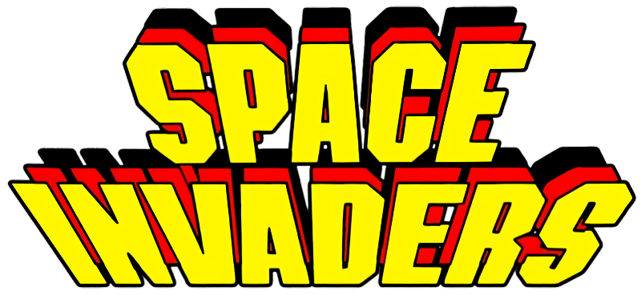
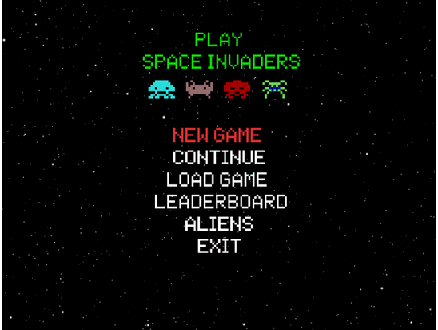

# Classic Space Invaders Game

<p align="center">
  
</p>

## Features

- Player moves ship horizontally by pressing on keyboard :heavy_check_mark:
- Player shoot aliens, which can move horizontally & vertically :heavy_check_mark:
- When bullet reach alien, alien disappear & total score increase :heavy_check_mark:
- Aliens can shoot too. When alien hit player, his lives decrease :heavy_check_mark:
- Player can hide behind obstacles
- Game ends when player lives become 0 :heavy_check_mark:
- Game has record table :heavy_check_mark:
- Game has sounds effects :heavy_check_mark:

## Preview



## Installation

- [Debian based Linux distros](doc/installation/ubuntu.md)
- [macOs](doc/installation/macos.md)

## Launch

```sh
ruby lib/space_invaders.rb
```

## Other resources

- [Demo](https://www.youtube.com/watch?v=MU4psw3ccUI)
- [Wiki](https://ru.wikipedia.org/wiki/Space_Invaders)
- [Gosu tutorial](https://leanpub.com/developing-games-with-ruby/read)
